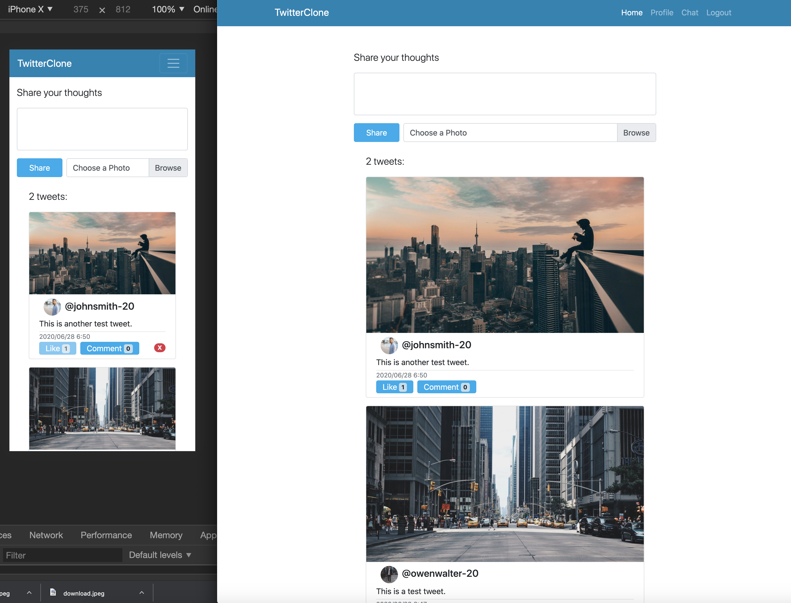
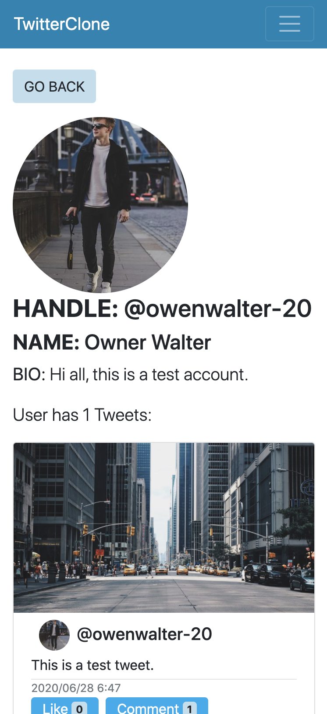
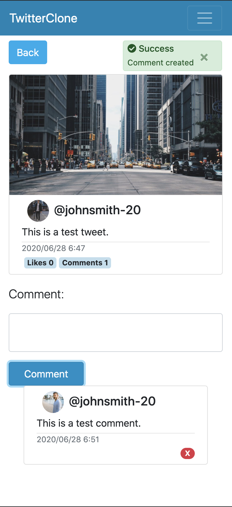
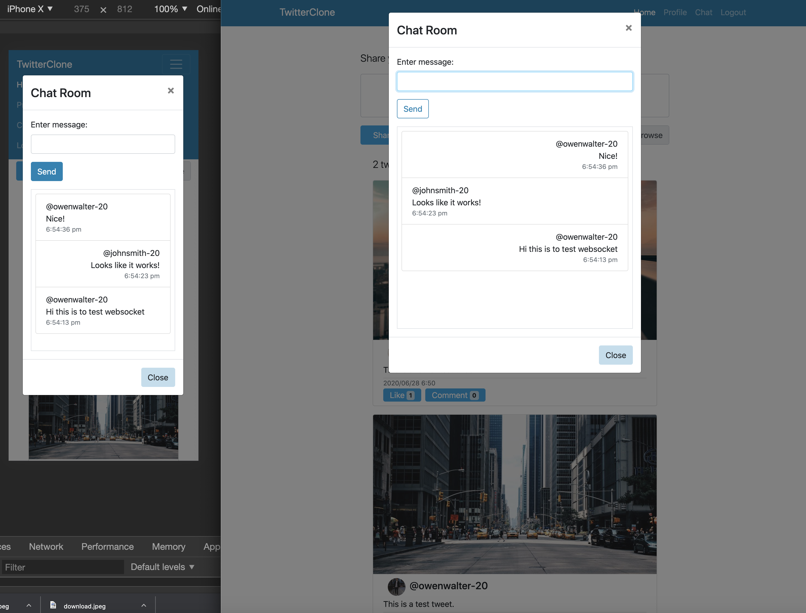
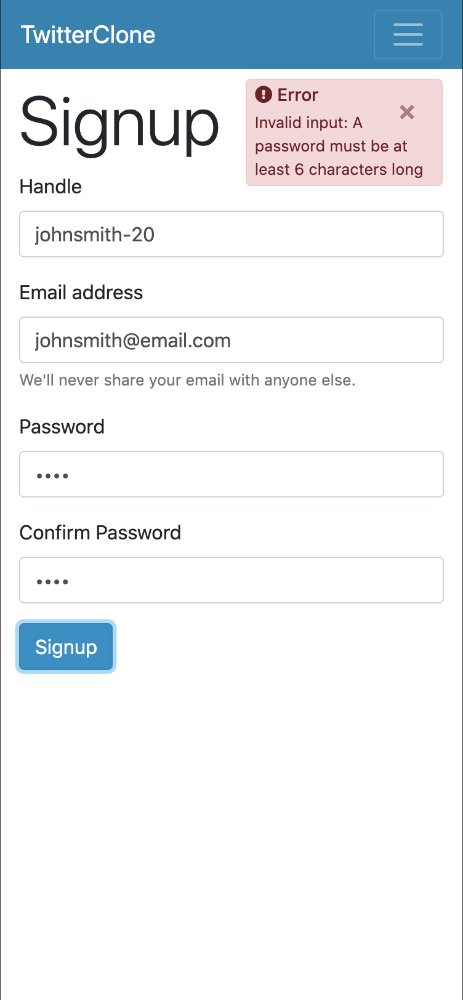

# MERN STACK TWITTER CLONE

### Main technolodges: Node/express, MongoDB/mongoose, React, Redux, Bootstrap. Implemented jwt authentication, full CRUD functionalities, real-time chat, image uploads, likes and comments, following-followers relationships, etc. 

---

**Current Features:**
- User login / signup
- Update profile info / profile image
- Access to users' profile pages
- Follow / unfollow a user
- Post tweets with image
- Like tweets / Remove own likes
- Comment tweets / delete own comments
- Delete own tweets
- Chat with followers and following users in real-time

---

[Project walk-through](https://www.loom.com/share/19d9f3201d944ea7b7a772ec764024e5)

[Live demo](https://hong-twitter-clone.herokuapp.com)
(File uploads work in development enviroment but not heroku server. Need to integrate amazon s3.)

---

## SHOWCASE:

### HOME PAGE

### PROFILE PAGE

### PROFILE PAGE

### CHAT PAGE

### AUTHENTICATION PAGE

### FOLLOWING / FOLLOWERS PAGE
