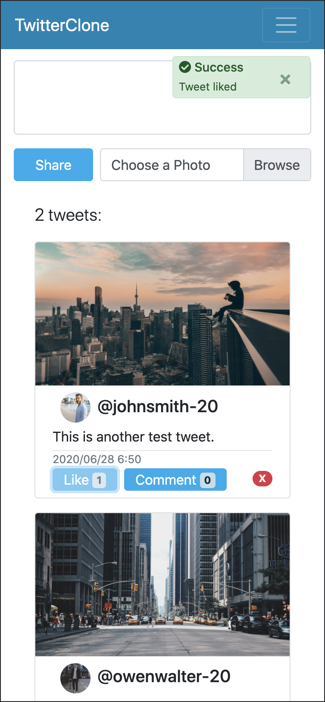
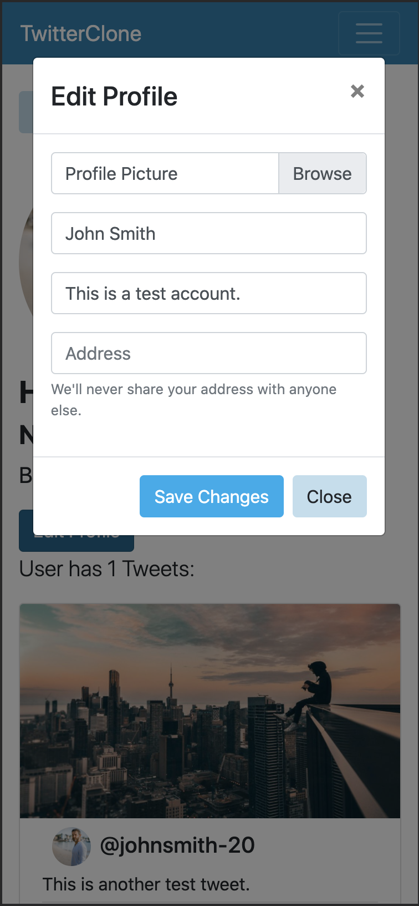

# MERN STACK TWITTER CLONE
### Main technolodges: Node/express MongoDB/mongoose React Redux Bootstrap. Implemented jwt authentication, full CRUD functionalities, image uploads, websokcet powered realtime chat, etc. 
---
**Current Features:**
- User login / signup
- Update profile info / profile image
- Access users' profile pages
- Post tweets / tweet with image
- Delete own tweets
- Like tweets / Remove own likes
- Comment tweets / delete own comments
- Real time chat room
---
[Live demo](https://hong-twitter-clone.herokuapp.com)
Tweet with image add profile pic works in development enviroment but not heroku server. Need to integrate amazon s3.
---
## SHOWCASE:

### HOME PAGE

### SIGNUP /w validation from backend

### LIKING A TWEET

### MAKING A COMMENT

### PROFILE PAGE

### EDITING PROFILE

### REAL TIME CHAT
